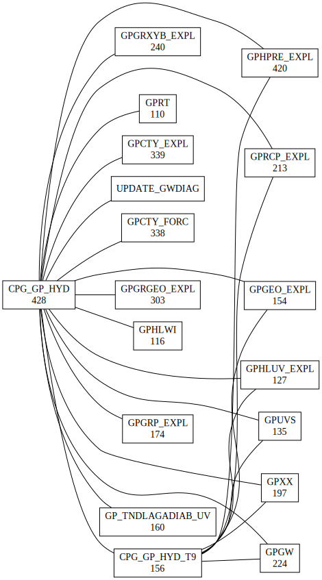

NAME
    dotpack

SYNOPSIS
      [CNC pack]$ cd 48t3_cpg_drv+.01.PGI2211.cpu0
      [CNC 48t3_cpg_drv+.01.PGI2211.cpu0]$ dotpack CPG_GP_HYD 
      [CNC 48t3_cpg_drv+.01.PGI2211.cpu0]$ ls -l CPG_GP_HYD.svg 
      -rw-r--r-- 1 marguina mrpm 14975 Mar 30 16:17 CPG_GP_HYD.svg

DESCRIPTION
    "dotpack" relies on graphviz to create call graphs.

SEE ALSO
    "gmkpack", graphviz

AUTHORS
    pmarguinaud@hotmail.com

